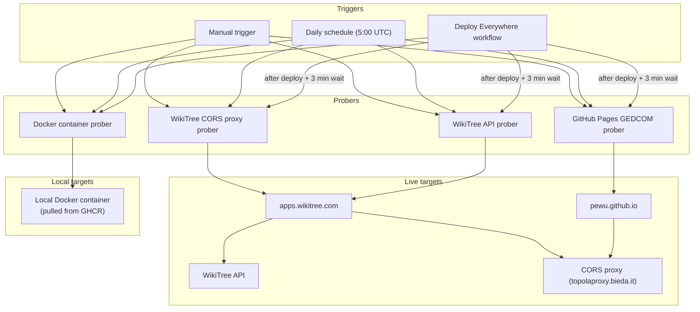

# Prober Tests Design Document

## 1. Problem Statement

Topola Viewer is deployed to two environments — GitHub Pages and
apps.wikitree.com — and depends on external services outside of our control:
the WikiTree API and a third-party CORS proxy (`topolaproxy.bieda.it`). Any of
these moving parts can break independently of our code: the WikiTree API can
change its response schema or rate-limit requests, the CORS proxy can go down
or change its URL scheme, and a deployment can silently introduce a routing or
build issue that only manifests in production. Our existing test suite is
hermetic — it mocks all network calls — so it verifies code correctness but
cannot detect when the live, deployed system stops working end-to-end. We need
lightweight smoke tests ("probers") that run against the live deployed URLs to
catch real-world breakage, both immediately after each deployment and on a
daily schedule.

## 2. The Technical Plan

The prober system consists of four independent smoke tests, each targeting a
specific combination of deployment target and data path. Three of the four
tests launch a real browser and navigate to a live deployed URL. The fourth
pulls the Docker image published to GHCR, runs it locally, and
verifies that the containerized application starts and renders data. All tests
verify that the chart renders, the side panel shows the expected person's name,
and no error message is displayed.

The four probers are:

1. **WikiTree direct API prober** — Loads a known WikiTree profile
   (`Skłodowska-2`) from the app deployed on `apps.wikitree.com`. This
   exercises the direct WikiTree API path (no CORS proxy) and confirms the
   WikiTree deployment is healthy.

2. **GitHub Pages GEDCOM prober** — Loads a GEDCOM file from a raw GitHub URL
   through the app on `pewu.github.io`. Because the app is not on the
   `apps.wikitree.com` domain, it routes the GEDCOM request through the CORS
   proxy. This exercises the GitHub Pages deployment, the CORS proxy, and
   GEDCOM-from-URL loading all at once.

3. **WikiTree GEDCOM + CORS proxy prober** — Loads the same GEDCOM-from-URL
   through the app on `apps.wikitree.com`. Even though the app is on the
   WikiTree domain, loading GEDCOM from a URL always uses the CORS proxy by
   default. This confirms the CORS proxy is reachable from the WikiTree
   deployment.

4. **Docker container prober** — Pulls the Docker image published to GHCR
   by `deploy-docker.yml`, runs it locally with the test GEDCOM file mounted
   via `STATIC_URL`, and verifies that the application renders the chart.
   This exercises the Docker build path (multi-stage `Dockerfile`, Caddy
   server configuration, static URL template injection) and confirms the
   published container image starts and serves data correctly.

Each prober is a standalone GitHub Actions workflow that can be triggered in
three ways: automatically after a deploy finishes, on a daily schedule, or
manually. When triggered after a deploy, the prober optionally waits a few
minutes for the deployment to propagate before running. The Docker prober does
not require a propagation wait because the container is available immediately
after startup.

The following diagram shows how the components fit together:



Each prober is a small Playwright test spec. Three specs run against live
deployed URLs; the Docker prober spec runs against a local Docker container
started by the workflow. The specs live in a separate `tests/probers/`
directory with their own Playwright configuration
(`playwright.prober.config.ts`) so they are completely isolated from the
existing hermetic test suite. Note: because the existing `playwright.config.ts`
uses `testDir: './tests'` and Playwright searches recursively, the e2e project
in the existing config must add `testIgnore: ['*_visual.spec.ts', 'probers/**']`
to prevent prober specs from being picked up by the regular CI test run
(`npm run test:e2e` or `npm run test:visual`). The prober config does not start
a local dev server — each spec navigates to a full absolute URL (or
`localhost:8080` for the Docker prober). A successful prober means a user can
load the app and see data; a failure means something in the chain is broken
and triggers an email notification. Note: GitHub Actions only sends email
notifications if the user has explicitly enabled email notifications in their
GitHub notification settings (Settings → Notifications → Email). If email
notifications are disabled, failures are only visible in the Actions UI.

## 3. Alternatives Considered & Rejected

The following alternatives were evaluated during the design discussion and
explicitly rejected. They are documented here to prevent future re-litigation
and to serve as guardrails against scope creep.

### Alternative A: Unit-level API integration tests against the live
WikiTree API

* **Considered:** Writing tests that call the raw `wikitree-js` library
  functions directly against the live WikiTree API, verifying response schemas
  and field presence.
* **Why Rejected:** This tests the `wikitree-js` dependency, not our code. Our
  existing Jest unit tests already cover our transformation logic using
  mocked API responses. The goal of probers is to verify the full
  end-to-end chain — browser, deployed app, network, API, proxy — not to
  re-verify API response shapes. Adding a separate layer of API-level
  integration tests would duplicate coverage without catching deployment or
  proxy issues.

### Alternative B: Testing the CORS proxy on apps.wikitree.com via the
WikiTree data path

* **Considered:** Forcing the WikiTree API calls through the CORS proxy when
  the app is deployed on `apps.wikitree.com`, to test the proxy from that
  domain.
* **Why Rejected:** The app hardcodes `handleCors` based on hostname — on
  `apps.wikitree.com`, WikiTree API calls always go direct (no proxy). There
  is no URL parameter to override this for the WikiTree data source. Forcing
  the proxy path would require a code change for test-only purposes, which is
  not justified. Instead, the CORS proxy is tested on `apps.wikitree.com`
  through the GEDCOM-from-URL path, which uses the proxy by default
  regardless of domain.

### Alternative C: Monolithic prober workflow with multiple jobs

* **Considered:** A single `prober.yml` workflow containing all four prober
  tests as separate jobs within it.
* **Why Rejected:** Separate workflow files give finer-grained control in the
  GitHub Actions UI — each prober can be triggered, re-run, or inspected
  independently. They also allow each prober to declare a targeted `needs`
  dependency on only the relevant deploy job (e.g., the WikiTree prober
  depends on `deploy-wikitree-apps`, not `deploy-gh-pages`). A monolithic
  workflow would couple all probers to the same trigger and make partial
  failures harder to manage.

### Alternative D: Probers that depend on all deploys finishing

* **Considered:** Making all four probers wait for all of `deploy-gh-pages`,
  `deploy-wikitree-apps`, and `deploy-docker` to complete before running
  any of them.
* **Why Rejected:** This unnecessarily delays probers whose target has
  already been deployed. The WikiTree probers only need the WikiTree deploy
  to finish; the GitHub Pages prober only needs the GitHub Pages deploy.
  Coupling them to all deploys adds latency without benefit, and means a
  failure in one deploy would block probers for the other.

### Alternative E: Unconditional sleep before every prober run

* **Considered:** Always waiting 3 minutes at the start of every prober run,
  regardless of trigger source.
* **Why Rejected:** The sleep is only necessary after a deploy, to allow
  GitHub Pages or WikiTree to propagate the new version. For daily scheduled
  runs and manual triggers, there is no recent deploy to wait for, so the
  sleep wastes 3 minutes. Instead, a `wait_for_propagation` input flag is
  passed as `true` only when the prober is invoked from the deploy workflow.

### Alternative F: Correctness assertions against specific WikiTree profile
data

* **Considered:** Asserting detailed data fields (e.g., specific birth dates,
  parent IDs, spouse counts) from the `Skłodowska-2` WikiTree profile to
  verify data correctness.
* **Why Rejected:** Probers are smoke tests — their job is to verify "does
  the pipe work?", not "is the data correct?". Data correctness is already
  verified by the hermetic test suite with controlled fixtures. Coupling
  probers to specific WikiTree profile data creates fragility: if anyone
  edits the WikiTree profile, the prober would break even though the system
  is healthy. Probers assert only that the expected person's name appears in
  the chart and side panel, and that no error is displayed.

## 4. Detailed Implementation Plan

This section enumerates every file that will be created or modified, in
the order they should be implemented, along with the rationale for each
change. The implementation is divided into five steps.

### Step 1: Prober Playwright configuration

**Create:** `playwright.prober.config.ts`

A separate Playwright configuration file dedicated to prober tests. This
file is distinct from the existing `playwright.config.ts` and serves a
different purpose: it does not start a local dev server, does not define
visual regression projects, and runs only against live deployed URLs.

Rationale for key configuration decisions:

* **No `webServer`** — The existing config starts a Vite dev/preview server
  on `localhost:3000`. The prober config does not use Playwright's
  `webServer` feature. Live-URL probers navigate to full absolute URLs;
  the Docker prober's workflow starts the container externally (via
  `docker run`) before the test runs, so Playwright connects to
  `localhost:8080` without a `webServer` definition.
* **`testDir: './tests/probers'`** — Prober specs are isolated in their own
  directory. Additionally, the existing `playwright.config.ts` e2e project
  must add `testIgnore: ['*_visual.spec.ts', 'probers/**']` to prevent
  prober specs from being discovered by the regular CI test run, since
  Playwright searches `testDir` recursively.
* **`fullyParallel: false`** — Tests run sequentially to avoid hammering the
  live WikiTree API and CORS proxy with concurrent requests, which could
  trigger rate-limiting.
* **`retries: 2`** — The WikiTree API and CORS proxy can have transient
  failures. Two retries (same as the existing CI config) provides a buffer
  against flakiness without masking persistent failures.
* **`timeout: 120000`** — The WikiTree API prober makes multiple sequential
  API calls (ancestors, descendants, relatives) that can take over 30
  seconds under load. The default 30s timeout is too short for live API
  probers; 120 seconds provides adequate headroom.
* **`reporter: [['html', {open: 'never'}], ['list']]`** — Generates an HTML
  report for upload as a workflow artifact, plus list output for console
  logs. Without this, no HTML report is produced and there is nothing to
  upload.
* **`forbidOnly: true`** — Since probers always run in CI, `forbidOnly`
  should be set to `true` to prevent `test.only` from accidentally blocking
  all other prober specs. (The existing config uses `forbidOnly:
  !!process.env.CI`, which achieves the same effect when `CI` is set, but
  probers should enforce this unconditionally.)
* **Single project named `prober` using `devices['Desktop Chrome']`** — No
  need for separate e2e/visual projects. All prober specs are smoke tests.
  The project must explicitly use `devices['Desktop Chrome']` to ensure a
  desktop viewport, because the side panel visibility depends on
  `window.matchMedia('(max-width: 767px)')` (see `src/util/url_args.ts:177`).
  Without an explicit device, Playwright's default viewport may be too
  narrow, causing the side panel to be hidden and the `.details` assertion
  to fail.
* **No `expect.toHaveScreenshot`** — Probers do not do visual regression
  testing; that is handled by the existing visual test project.
* **`trace: 'on-first-retry'`, `screenshot: 'only-on-failure'`,
  `video: 'on-first-retry'`** — For live-URL probers where failures are hard
  to reproduce, trace files, failure screenshots, and retry videos are
  essential for debugging.
* **`locale: 'en-US'`** — Forces consistent rendering and translation keys,
  matching the existing CI config. Without this, the app renders in the CI
  runner's default locale, which is non-deterministic.

### Step 2: Prober test specifications

Four test spec files, one per prober. Each follows the same structure but
targets a different URL and asserts a different expected name.

**Create:** `tests/probers/wikitree.spec.ts`

* **Target URL:**
  `https://apps.wikitree.com/apps/wiech13/topola-viewer/#/view?source=wikitree&indi=Sk%C5%82odowska-2`
  (URL-encoded `Skłodowska-2` to avoid encoding ambiguity with the non-ASCII
  character `ł` in source code).
* **Expected name:** `Skłodowska` (from the WikiTree profile
  `Skłodowska-2` — Marie Skłodowska-Curie). The chart displays
  `LastNameAtBirth`, which is `Skłodowska` for this profile.
* **What it exercises:** WikiTree direct API (no CORS proxy), WikiTree
  deployment.
* **Note:** Does not use `standalone=true` in the URL. The app defaults to
  standalone mode when not embedded and no static URL is set (see
  `src/util/url_args.ts:198`).

**Create:** `tests/probers/gh-pages-gedcom.spec.ts`

* **Target URL:**
  `https://pewu.github.io/topola-viewer/#/view?url=https://raw.githubusercontent.com/PeWu/topola-viewer/master/src/datasource/testdata/test.ged&indi=I1`
* **Expected name:** `Bonifacy` (individual `@I1@` in `test.ged`, line 16:
  `1 NAME Bonifacy /Gibbs/`).
* **What it exercises:** GitHub Pages deployment, CORS proxy
  (`topolaproxy.bieda.it`), GEDCOM-from-URL loading. The app uses the CORS
  proxy by default for GEDCOM URLs (`handleCors` defaults to `true` — see
  `src/util/url_args.ts:156`).

**Create:** `tests/probers/wikitree-cors-gedcom.spec.ts`

* **Target URL:**
  `https://apps.wikitree.com/apps/wiech13/topola-viewer/#/view?url=https://raw.githubusercontent.com/PeWu/topola-viewer/master/src/datasource/testdata/test.ged&indi=I1`
* **Expected name:** `Bonifacy` (same as above).
* **What it exercises:** WikiTree deployment, CORS proxy from the WikiTree
  domain. Even on `apps.wikitree.com`, GEDCOM-from-URL uses the CORS proxy
  by default (the `handleCors` hostname check in `src/datasource/wikitree_api.ts:273`
  only affects WikiTree API calls, not GEDCOM URL fetches in
  `src/datasource/load_data.ts:174`). Note: probers do not block Google Analytics scripts,
  so live-URL prober runs generate real analytics events on each run. This
  is intentional — the prober tests the unmodified deployed app, and
  blocking analytics would not reflect the real user experience.

**Create:** `tests/probers/docker.spec.ts`

* **Target URL:** `http://localhost:8080/` (local Docker container).
* **Expected name:** `Bonifacy` (same GEDCOM test file, mounted into the
  container via `STATIC_URL=test.ged`).
* **What it exercises:** Published Docker image from GHCR (multi-stage
  `Dockerfile` build output, Caddy server configuration, static URL
  template injection (`{{ env "STATIC_URL" }}` in `index.html`)), and app
  rendering with a pre-loaded GEDCOM.
* **Note:** The workflow pulls the Docker image published to GHCR
  (`ghcr.io/pewu/topola-viewer:latest`), runs it with
  `docker run -p 8080:8080 -e STATIC_URL=test.ged`, mounts
  `src/datasource/testdata/test.ged` into the container, and points
  Playwright at `localhost:8080`. The app loads in non-standalone mode
  (because `staticUrl` is set) and navigates directly to the chart view
  (see `app.tsx` routing logic). The Docker image does not include Google
  credentials (`VITE_GOOGLE_CLIENT_ID`, `VITE_GOOGLE_API_KEY`), so the
  Google Drive integration is non-functional in the containerized app.
  This is acceptable for the prober, which only tests chart rendering.
  Note: the Docker prober tests the image published to GHCR by
  `deploy-docker.yml`, ensuring the published artifact is functional.

**Shared test structure** (in each spec):

```
1. Navigate to the target URL.
2. Wait for #content to be visible. This indicates the app has reached
   `SHOWING_CHART` state and the React tree has rendered the chart
   container. Note: `#content` becomes visible *before* the D3 chart SVG
   is populated — the actual chart text is rendered by a `useEffect` in
   the `Chart` component that fires after `#content` appears. The
   subsequent `#chart` text assertion relies on Playwright's auto-wait
   to bridge this gap.
3. Assert expected name appears in #chart (chart SVG text).
4. Assert expected name appears in div.details (side panel).
5. Assert .ui.error.message is not visible (no fatal error).
6. Assert .ui.errorPopup.message is not visible (no popup error).
```

The `.ui.errorPopup.message` selector must be scoped at the document level
(e.g., `page.locator('.ui.errorPopup.message')`), not scoped to `#content`,
because `ErrorPopup` uses Semantic UI React's `<Portal>` which renders at
`document.body` level.

Selectors are derived from the source code:

* `#content` — main container, visible when chart state is `SHOWING_CHART`
  (see `src/pages/view_page.tsx:202`).
* `#chart` — SVG group inside the chart (see `src/chart.tsx:599`).
* `div.details` — side panel Details tab content (see `src/sidepanel/details/details.tsx:357`).
* `.ui.error.message` — fatal error replacing the chart (see
  `src/components/error_display.tsx`, rendered when state is `ERROR`). The `ui` and
  `message` classes are added by Semantic UI React's `<Message>`
  component; the `error` class comes from the custom `className="error"`
  prop in `ErrorMessage`. The resulting DOM element is
  `<div class="ui negative message error">`, so the selector
  `.ui.error.message` matches it.
* `.ui.errorPopup.message` — dismissable popup error (see
  `src/components/error_display.tsx`). As above, `ui` and `message` come from
  Semantic UI React's `<Message>`, and `errorPopup` comes from the
  custom `className="errorPopup"` prop. Note: `ErrorPopup` uses Semantic
  UI React's `<Portal>`, which renders its content at `document.body`
  level, not inside `#content` in the DOM. When the popup is closed
  (`open={false}`), the Portal renders nothing, so this assertion
  verifies absence rather than visibility.

The side panel is expanded by default on desktop viewports (the prober project
uses `devices['Desktop Chrome']`). The `getShowSidePanel` function in
`src/util/url_args.ts:177` returns `true` on non-mobile screens, so the `div.details`
container is visible without any URL parameters.

### Step 3: Prober GitHub Actions workflows

All prober workflows should declare minimal permissions for security:

```yaml
permissions:
  contents: read
  actions: write
```

All prober workflows should use `actions/checkout@v4` (not v2, which is
used by some older deploy workflows).

All prober workflows should set `timeout-minutes: 15` on each job to prevent
hanging runs from consuming runner minutes (default GitHub Actions timeout is
6 hours).

All prober workflows should define a `concurrency` group to prevent
overlapping runs (e.g., a deploy-triggered run overlapping with a
schedule-triggered run):

```yaml
concurrency:
  group: prober-${{ github.workflow }}
  cancel-in-progress: false
```

`cancel-in-progress: false` ensures a deploy-triggered run is not cancelled
by a scheduled run — both complete independently.

Four reusable workflow files, one per prober. The three live-URL probers
are identical in structure — only the name and artifact name differ. The
Docker prober has a different structure (it builds and runs the container
before testing).

**Create:** `.github/workflows/prober-wikitree.yml`

* **Triggers:** `workflow_call` (with `wait_for_propagation` input),
  `workflow_dispatch` (with `wait_for_propagation` input), `schedule`
  (daily at `0 5 * * *` UTC = ~6:00/7:00 CET).
* **Depends on (when called from deploy):** `deploy-wikitree-apps.yml`
  only.
* **Artifact name:** `prober-report-wikitree`.

**Create:** `.github/workflows/prober-gh-pages.yml`

* Same structure.
* **Depends on (when called from deploy):** `deploy-gh-pages.yml` only.
* **Artifact name:** `prober-report-gh-pages`.

**Create:** `.github/workflows/prober-wikitree-cors.yml`

* Same structure.
* **Depends on (when called from deploy):** `deploy-wikitree-apps.yml`
  only.
* **Artifact name:** `prober-report-wikitree-cors`.

**Create:** `.github/workflows/prober-docker.yml`

* **Triggers:** `workflow_call`, `workflow_dispatch`, `schedule`
  (daily at `0 5 * * *` UTC).
* **Depends on (when called from deploy):** `deploy-docker.yml` only.
* **Artifact name:** `prober-report-docker`.
* **No `wait_for_propagation` input** — The Docker container is available
  immediately after startup; no propagation delay is needed.

**Shared workflow structure** (live-URL probers):

```
1. Checkout repository (actions/checkout@v4).
2. Setup Node.js 24.x with npm cache.
3. Run npm ci.
4. If wait_for_propagation is true, sleep 180 seconds.
5. Get Playwright version (same pattern as node.js.yml: extract version
   from @playwright/test/package.json into a cache key).
6. Cache Chromium browser binaries (keyed by Playwright version). If cache
   misses, install Playwright with system dependencies
   (npx playwright install-deps chromium && npx playwright install
   chromium). With daily + post-deploy runs, caching avoids re-downloading
   ~150MB on every run.
7. Run: npx playwright test --config=playwright.prober.config.ts "${SPEC}"
   Each workflow sets a SPEC environment variable (e.g.,
   SPEC=wikitree.spec.ts) to select only the relevant spec file. Without
   this filter, Playwright would run all specs in the testDir for every
   prober workflow.
8. Upload Playwright HTML report as artifact (if: always()). Set
   PLAYWRIGHT_HTML_REPORT=playwright-report/prober to avoid path
   conflicts with other report artifacts. Set `retention-days: 30` to
   limit storage consumption — prober runs (daily + post-deploy) generate
   traces, screenshots, and videos that can accumulate quickly.
```

**Docker prober workflow structure** (different from live-URL probers):

```
1. Checkout repository (actions/checkout@v4).
2. Pull Docker image: docker pull ghcr.io/pewu/topola-viewer:latest
   (Pull the image published by deploy-docker.yml. This tests the actual
   published artifact, not a local build. The GHCR package is public, so
   no `docker login` authentication step is required.)
3. Run container: docker run -d -p 8080:8080 -e STATIC_URL=test.ged
   -v $(pwd)/src/datasource/testdata/test.ged:/app/public/test.ged
   --name topola-prober-${{ github.run_id }}
   ghcr.io/pewu/topola-viewer:latest
   (Use a unique container name with github.run_id to prevent name
   conflicts if a previous run didn't clean up or if runs overlap.)
4. Wait for container to be ready: use a bash retry loop with `curl` to
   poll `http://localhost:8080/` until it responds with HTTP 200
   (timeout 30s, 1s interval):
   ```bash
   for i in $(seq 1 30); do
     if curl -sf -o /dev/null http://localhost:8080/; then break; fi
     sleep 1
   done
   curl -sf -o /dev/null http://localhost:8080/
   ```
   The final `curl` ensures the workflow fails with a clear error if
   the container never became ready. This prevents a race condition
   where the test runs before Caddy is ready to serve requests.
5. Setup Node.js 24.x with npm cache.
6. Run npm ci.
7. Get Playwright version (same pattern as node.js.yml).
8. Cache and install Playwright (same as live-URL probers).
9. Run: npx playwright test --config=playwright.prober.config.ts docker.spec.ts
10. Upload Playwright HTML report as artifact (if: always()). Set
    `retention-days: 30` (same as live-URL probers).
11. Stop and remove container (if: always()): docker stop
    topola-prober-${{ github.run_id }} 2>/dev/null; docker rm
    topola-prober-${{ github.run_id }} 2>/dev/null; true
    (The if: always() ensures cleanup runs even on failure. The
    2>/dev/null and trailing true prevent errors if the container was
    never started, e.g., pull failed at step 2.)
```

**`wait_for_propagation` input flag** (live-URL probers only):

* Defined under both `workflow_call` and `workflow_dispatch` triggers.
* Type: `boolean`, default: `false`.
* When invoked from `deploy-everywhere.yml`, passed as `true`.
* When triggered by schedule or manual (unchecked), defaults to `false`.
* The sleep step uses `if: inputs.wait_for_propagation` to conditionally
  execute.
* The Docker prober workflow does not define this input — the container is
  available immediately after `docker run`, so no propagation wait is needed.

### Step 4: Modify deploy-everywhere workflow

**Modify:** `.github/workflows/deploy-everywhere.yml`

Add four prober jobs that call the reusable prober workflows. Each prober
depends only on its relevant deploy job, not on all deploys.

Current state (before changes):

```yaml
jobs:
  deploy-gh-pages:
    uses: ./.github/workflows/deploy-gh-pages.yml
    secrets: inherit
  deploy-wikitree-apps:
    uses: ./.github/workflows/deploy-wikitree-apps.yml
    secrets: inherit
  deploy-docker:
    uses: ./.github/workflows/deploy-docker.yml
    secrets: inherit
```

After changes:

```yaml
jobs:
  deploy-gh-pages:
    uses: ./.github/workflows/deploy-gh-pages.yml
    secrets: inherit
  deploy-wikitree-apps:
    uses: ./.github/workflows/deploy-wikitree-apps.yml
    secrets: inherit
  deploy-docker:
    uses: ./.github/workflows/deploy-docker.yml
    secrets: inherit

  prober-wikitree:
    needs: deploy-wikitree-apps
    uses: ./.github/workflows/prober-wikitree.yml
    secrets: inherit
    with:
      wait_for_propagation: true
  prober-gh-pages:
    needs: deploy-gh-pages
    uses: ./.github/workflows/prober-gh-pages.yml
    secrets: inherit
    with:
      wait_for_propagation: true
  prober-wikitree-cors:
    needs: deploy-wikitree-apps
    uses: ./.github/workflows/prober-wikitree-cors.yml
    secrets: inherit
    with:
      wait_for_propagation: true
  prober-docker:
    needs: deploy-docker
    uses: ./.github/workflows/prober-docker.yml
    secrets: inherit
```

Rationale for dependency mapping:

* `prober-wikitree` needs `deploy-wikitree-apps` — it tests the WikiTree
  deployment.
* `prober-gh-pages` needs `deploy-gh-pages` — it tests the GitHub Pages
  deployment.
* `prober-wikitree-cors` needs `deploy-wikitree-apps` — it tests the
  WikiTree deployment (with CORS proxy).
* `prober-docker` needs `deploy-docker` — it tests the Docker image
  published to GHCR by `deploy-docker.yml` (Dockerfile, Caddy config, app
  startup). It does not pass `wait_for_propagation` because the container is
  available immediately after `docker run`.
* If a prober fails, the `deploy-everywhere` workflow is marked as failed
  (red X), triggering an email notification (if GitHub email notifications
  are enabled — see note in Section 2).
* Note: Individual deploy workflows (`deploy-gh-pages.yml`,
  `deploy-wikitree-apps.yml`, `deploy-docker.yml`) also support
  `workflow_dispatch`. If a deploy is triggered directly (instead of
  through `deploy-everywhere.yml`), no probers run because probers are only
  called from `deploy-everywhere.yml`. To ensure probers always run after a
  deploy, always trigger deploys through `deploy-everywhere.yml`.

### Step 5: Update supporting files

**Modify:** `playwright.config.ts`

Add `testIgnore: ['*_visual.spec.ts', 'probers/**']` to the e2e project to
prevent prober specs in `tests/probers/` from being discovered by the regular
CI e2e test run. Without this, `npm run test:e2e` would try to execute
prober specs against the local dev server, causing failures.

**Modify:** `package.json`

Add a `test:probers` script for running probers locally during development:

```json
"test:probers": "playwright test --config=playwright.prober.config.ts"
```

**Modify:** `tests/tsconfig.json`

Add `probers/` to the `include` array so prober specs are type-checked by
`tsc -p tests/tsconfig.json --noEmit` (which runs in CI via
`node.js.yml`).

Current state:

```json
{
  "compilerOptions": { ... },
  "include": ["./**/*.ts", "./**/*.d.ts"]
}
```

The existing `./**/*.ts` glob already includes `tests/probers/` — no
modification needed. The `./**/*.d.ts` glob covers type declaration files
and does not affect prober spec discovery.

**Modify:** `.github/workflows/README.md`

Add entries for the four new prober workflows to the file registry, e.g.:

```markdown
- [prober-wikitree.yml](prober-wikitree.yml): Reusable prober that
  smoke-tests the WikiTree direct API path on the live WikiTree deployment.
  Runs daily and after deploy.
- [prober-gh-pages.yml](prober-gh-pages.yml): Reusable prober that
  smoke-tests the GitHub Pages deployment with GEDCOM-from-URL through the
  CORS proxy. Runs daily and after deploy.
- [prober-wikitree-cors.yml](prober-wikitree-cors.yml): Reusable prober
  that smoke-tests the CORS proxy from the WikiTree deployment with
  GEDCOM-from-URL. Runs daily and after deploy.
- [prober-docker.yml](prober-docker.yml): Reusable prober that
  smoke-tests the published Docker image from GHCR (Dockerfile, Caddy
  config, app startup) by pulling and running it locally. Runs daily and
  after deploy.
```

**Create:** `tests/probers/README.md`

Document the prober test directory, explaining that these are live smoke
tests (not hermetic), how to run them locally (`npm run test:probers`), and
that they require network access to external services (WikiTree API, CORS
proxy, GitHub raw URLs).

**Modify:** `PROJECT_STRUCTURE.md`

Add entries for the new `tests/probers/` directory and
`playwright.prober.config.ts` file.

**Modify:** `docs/README.md`

Add an entry for this design document to the registry:

```markdown
* **[PROBERS_DESIGN.md](PROBERS_DESIGN.md)**: Live prober smoke tests
  against deployed GitHub Pages, WikiTree URLs, and local Docker container,
  covering WikiTree API, CORS proxy, GEDCOM-from-URL, and Docker build paths.
```

### Summary of all files

| File | Action | Purpose |
|---|---|---|
| `playwright.prober.config.ts` | Create | Separate Playwright config for probers (no local server, live URLs) |
| `playwright.config.ts` | Modify | Add `testIgnore` for `probers/**` to e2e project |
| `package.json` | Modify | Add `test:probers` script |
| `tests/probers/wikitree.spec.ts` | Create | WikiTree direct API smoke test |
| `tests/probers/gh-pages-gedcom.spec.ts` | Create | GitHub Pages + CORS proxy smoke test |
| `tests/probers/wikitree-cors-gedcom.spec.ts` | Create | WikiTree + CORS proxy smoke test |
| `tests/probers/docker.spec.ts` | Create | Docker container smoke test |
| `.github/workflows/prober-wikitree.yml` | Create | Reusable workflow: WikiTree prober |
| `.github/workflows/prober-gh-pages.yml` | Create | Reusable workflow: GH Pages prober |
| `.github/workflows/prober-wikitree-cors.yml` | Create | Reusable workflow: WikiTree CORS prober |
| `.github/workflows/prober-docker.yml` | Create | Reusable workflow: Docker prober (pulls GHCR image) |
| `.github/workflows/deploy-everywhere.yml` | Modify | Add prober jobs with targeted deploy dependencies |
| `tests/tsconfig.json` | Modify | Ensure prober specs are type-checked |
| `tests/probers/README.md` | Create | Document prober directory and usage |
| `.github/workflows/README.md` | Modify | Document new prober workflows |
| `docs/README.md` | Modify | Add prober design doc to registry |
| `PROJECT_STRUCTURE.md` | Modify | Add prober directory and config file |


## 5. Future Considerations

### WikiTree Login Flow Prober

The current WikiTree prober tests the unauthenticated API path (loading a
public profile without an authcode). A future prober could test the
authenticated login flow — logging in with an authcode and verifying that
private profiles are accessible. This would require obtaining a dedicated
test account on wikitree.com and storing the authcode as a GitHub Actions
secret. This is deferred because it adds complexity (secret management,
authcode expiry, test account maintenance) and the unauthenticated path
already covers the most common deployment scenario.

### Google Drive Integration Prober

A prober for the Google Drive integration (loading a GEDCOM file from
Google Drive) is not included. Google's OAuth flow is designed for human
interaction and includes bot detection (CAPTCHA, device verification) that
would likely prevent automated login. Additionally, the Google Drive
integration requires `VITE_GOOGLE_CLIENT_ID` and `VITE_GOOGLE_API_KEY`
secrets, which are not available in the prober environment. A possible
workaround would be to use a pre-authorized service account or a long-lived
refresh token stored as a secret, but this is complex and fragile. This is
deferred until a reliable automation approach is identified.
